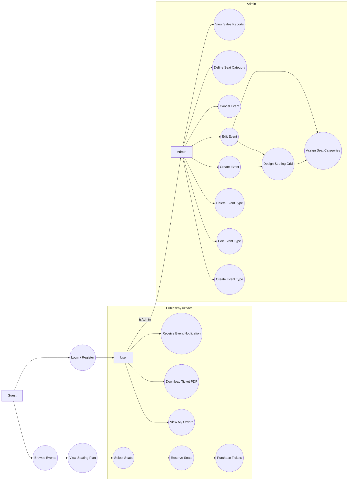
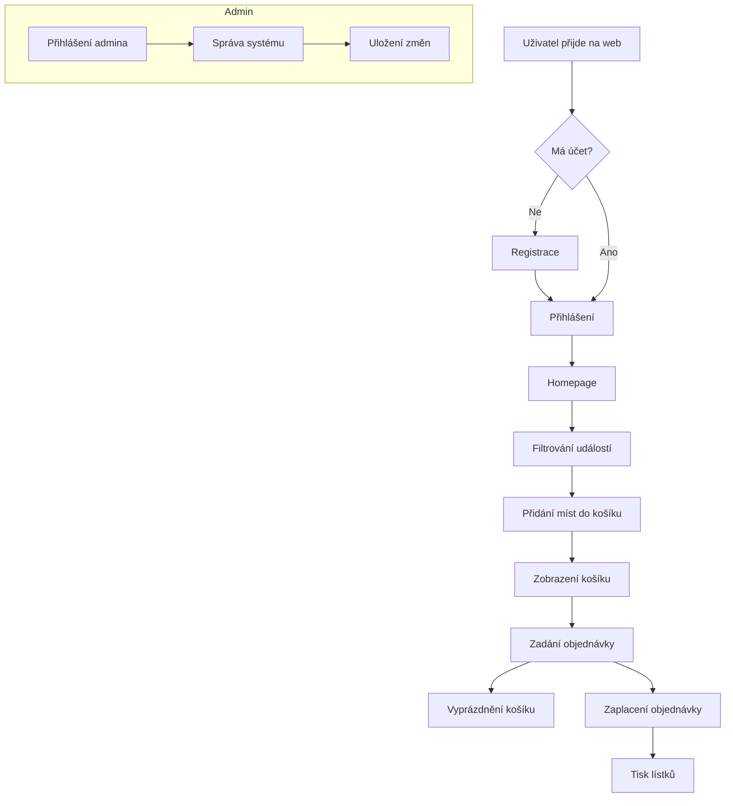
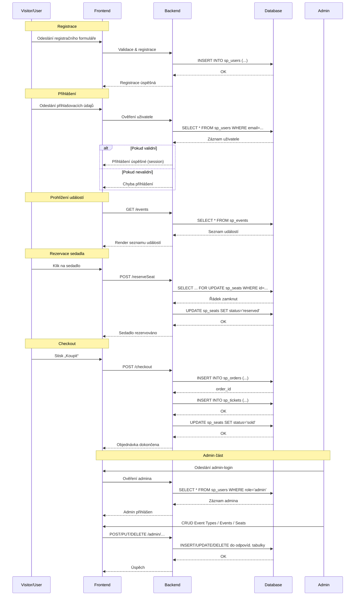

# Systém pro správu a prodej vstupenek na veřejné události

## Stručný popis funkcionalit

Nepřihlášení uživatelé:

- Vidí seznam dostupných událostí a interaktivní sedadlový plán

Přihlášení uživatelé:

- Vidí seznam dostupných událostí a interaktivní sedadlový plán
- Kupují vstupenky – při pokusu o rezervaci se řádek sedadla uzamkne, aby nedošlo k duplicitě
- Mají přehled o svých nadcházejících i minulých akcích
- Generují si PDF svých lístků

Administrátor (role `admin`) má plná práva nad systémem a může:

- **Správa uživatelů a rolí**

  - Vytvářet, upravovat a mazat uživatele
  - Přiřazovat a odebírat role (např. `admin`, `event_manager`)

- **Správa typů událostí**

  - Přidávat, upravovat nebo mazat záznamy v tabulce `sp_event_types`
  - Definovat nové kategorie událostí (koncert, divadlo, konference …)

- **Správa událostí**
  - Vytvářet, upravovat a rušit libovolnou událost
  - Nastavovat termíny, popisky, místo konání, typ události, cenu vstupného
- **Správa sedadel a cenových kategorií**

  - Definovat cenové kategorie sedadel (VIP, Standard, …)
  - Upravovat rozvržení (grid, gapy) a přiřazení cen jednotlivým sedadlům

- **Monitorování a údržba**
  - Prohlížet logy a statistiky prodeje napříč všemi událostmi

Další klíčové funkce:

- Autentizace a role (admin vs. uživatel) s ochranou proti CSRF, XSS a SQL injection
- E-mailová notifikace o blížících se událostech
- SEO-friendly, validní HTML5 se sémantickými značkami

## Use case diagram



## Databáze

### sp_users

| Sloupec         | Datový typ          | Popis                            |
| --------------- | ------------------- | -------------------------------- |
| `id`            | INT (PK, AI)        | Primární klíč uživatele          |
| `name`          | VARCHAR(255)        | Jméno uživatele                  |
| `email`         | VARCHAR(255) UNIQUE | E-mail uživatele (unikátní)      |
| `password_hash` | VARCHAR(255)        | Hash hesla                       |
| `created_at`    | DATETIME            | Čas vytvoření záznamu            |
| `updated_at`    | DATETIME            | Čas poslední aktualizace záznamu |

```sql
CREATE TABLE `sp_users` (
  `id` INT NOT NULL AUTO_INCREMENT,
  `name` VARCHAR(255) NOT NULL,
  `email` VARCHAR(255) NOT NULL,
  `password_hash` VARCHAR(255) NOT NULL,
  `created_at` DATETIME DEFAULT CURRENT_TIMESTAMP,
  `updated_at` DATETIME DEFAULT CURRENT_TIMESTAMP ON UPDATE CURRENT_TIMESTAMP,
  PRIMARY KEY (`id`),
  UNIQUE KEY `ux_sp_users_email` (`email`)
)
```

### sp_roles

| Sloupec | Datový typ   | Popis                 |
| ------- | ------------ | --------------------- |
| `id`    | INT (PK, AI) | Primární klíč role    |
| `name`  | VARCHAR(50)  | Název role (unikátní) |

```sql
CREATE TABLE `sp_roles` (
  `id` INT NOT NULL AUTO_INCREMENT,
  `name` VARCHAR(50) NOT NULL,
  PRIMARY KEY (`id`),
  UNIQUE KEY `ux_sp_roles_name` (`name`)
)
```

### sp_user_roles

| Sloupec   | Datový typ | Popis               |
| --------- | ---------- | ------------------- |
| `user_id` | INT        | FK → `sp_users(id)` |
| `role_id` | INT        | FK → `sp_roles(id)` |

```sql
CREATE TABLE `sp_user_roles` (
  `user_id` INT NOT NULL,
  `role_id` INT NOT NULL,
  PRIMARY KEY (`user_id`,`role_id`),
  CONSTRAINT `fk_usr_rl_user` FOREIGN KEY (`user_id`) REFERENCES `sp_users`(`id`) ON DELETE CASCADE,
  CONSTRAINT `fk_usr_rl_role` FOREIGN KEY (`role_id`) REFERENCES `sp_roles`(`id`) ON DELETE CASCADE
)
```

### sp_event_types

| Sloupec | Datový typ   | Popis                         |
| ------- | ------------ | ----------------------------- |
| `id`    | INT (PK, AI) | Primární klíč typu události   |
| `name`  | VARCHAR(100) | Název typu (koncert, divadlo) |

```sql
CREATE TABLE `sp_event_types` (
  `id` INT NOT NULL AUTO_INCREMENT,
  `name` VARCHAR(100) NOT NULL,
  PRIMARY KEY (`id`)
)
```

### sp_events

| Sloupec          | Datový typ   | Popis                                 |
| ---------------- | ------------ | ------------------------------------- |
| `id`             | INT (PK, AI) | Primární klíč události                |
| `title`          | VARCHAR(255) | Název události                        |
| `description`    | TEXT         | Popis události                        |
| `location`       | VARCHAR(255) | Místo konání                          |
| `start_datetime` | DATETIME     | Začátek události                      |
| `end_datetime`   | DATETIME     | Konec události                        |
| `event_type_id`  | INT          | FK → `sp_event_types(id)`             |
| `created_by`     | INT          | FK → `sp_users(id)` (pořadatel/admin) |
| `created_at`     | DATETIME     | Čas vložení do systému                |
| `updated_at`     | DATETIME     | Čas poslední úpravy                   |

```sql
CREATE TABLE `sp_events` (
  `id` INT NOT NULL AUTO_INCREMENT,
  `title` VARCHAR(255) NOT NULL,
  `description` TEXT,
  `location` VARCHAR(255),
  `start_datetime` DATETIME NOT NULL,
  `end_datetime` DATETIME NOT NULL,
  `event_type_id` INT NOT NULL,
  `created_by` INT NOT NULL,
  `created_at` DATETIME DEFAULT CURRENT_TIMESTAMP,
  `updated_at` DATETIME DEFAULT CURRENT_TIMESTAMP ON UPDATE CURRENT_TIMESTAMP,
  PRIMARY KEY (`id`),
  CONSTRAINT `fk_events_type` FOREIGN KEY (`event_type_id`) REFERENCES `sp_event_types`(`id`),
  CONSTRAINT `fk_events_user` FOREIGN KEY (`created_by`) REFERENCES `sp_users`(`id`)
)
```

### sp_seat_categories

| Sloupec | Datový typ    | Popis                           |
| ------- | ------------- | ------------------------------- |
| `id`    | INT (PK, AI)  | Primární klíč kategorie         |
| `name`  | VARCHAR(50)   | Název kategorie (VIP, Standard) |
| `price` | DECIMAL(10,2) | Cena v CZK                      |

```sql
CREATE TABLE `sp_seat_categories` (
  `id` INT NOT NULL AUTO_INCREMENT,
  `name` VARCHAR(50) NOT NULL,
  `price` DECIMAL(10,2) NOT NULL,
  PRIMARY KEY (`id`)
)
```

### sp_seats

| Sloupec            | Datový typ                     | Popis                         |
| ------------------ | ------------------------------ | ----------------------------- |
| `id`               | INT (PK, AI)                   | Primární klíč záznamu sedadla |
| `event_id`         | INT                            | FK → `sp_events(id)`          |
| `row_index`        | SMALLINT                       | Číslo řady (1-based)          |
| `col_index`        | SMALLINT                       | Číslo sloupce (1-based)       |
| `seat_category_id` | INT                            | FK → `sp_seat_categories(id)` |
| `status`           | ENUM('free','reserved','sold') | Stav sedadla                  |

```sql
CREATE TABLE `sp_seats` (
  `id` INT NOT NULL AUTO_INCREMENT,
  `event_id` INT NOT NULL,
  `row_index` SMALLINT NOT NULL,
  `col_index` SMALLINT NOT NULL,
  `seat_category_id` INT NOT NULL,
  `status` ENUM('free','reserved','sold') NOT NULL DEFAULT 'free',
  PRIMARY KEY (`id`),
  UNIQUE KEY `ux_seat_unique` (`event_id`,`row_index`,`col_index`),
  CONSTRAINT `fk_seats_event` FOREIGN KEY (`event_id`) REFERENCES `sp_events`(`id`),
  CONSTRAINT `fk_seats_category` FOREIGN KEY (`seat_category_id`) REFERENCES `sp_seat_categories`(`id`)
)
```

### sp_orders

| Sloupec      | Datový typ   | Popis                           |
| ------------ | ------------ | ------------------------------- |
| `order_id`   | INT (PK, AI) | Primární klíč objednávky        |
| `user_id`    | INT          | FK → `sp_users(id)`             |
| `order_date` | DATETIME     | Datum vytvoření objednávky      |
| `status`     | VARCHAR(50)  | Stav objednávky (pending, paid) |

```sql
CREATE TABLE `sp_orders` (
  `order_id` INT NOT NULL AUTO_INCREMENT,
  `user_id` INT NOT NULL,
  `order_date` DATETIME DEFAULT CURRENT_TIMESTAMP,
  `status` VARCHAR(50) NOT NULL,
  PRIMARY KEY (`order_id`),
  CONSTRAINT `fk_orders_user` FOREIGN KEY (`user_id`) REFERENCES `sp_users`(`id`)
)
```

### sp_tickets

| Sloupec    | Datový typ   | Popis                      |
| ---------- | ------------ | -------------------------- |
| `id`       | INT (PK, AI) | Primární klíč vstupenky    |
| `order_id` | INT          | FK → `sp_orders(order_id)` |
| `seat_id`  | INT          | FK → `sp_seats(id)`        |

```sql
CREATE TABLE `sp_tickets` (
  `id` INT NOT NULL AUTO_INCREMENT,
  `order_id` INT NOT NULL,
  `seat_id` INT NOT NULL,
  PRIMARY KEY (`id`),
  CONSTRAINT `fk_tickets_order` FOREIGN KEY (`order_id`) REFERENCES `sp_orders`(`order_id`),
  CONSTRAINT `fk_tickets_seat` FOREIGN KEY (`seat_id`) REFERENCES `sp_seats`(`id`)
)
```

### sp_payments

| Sloupec          | Datový typ    | Popis                            |
| ---------------- | ------------- | -------------------------------- |
| `id`             | INT (PK, AI)  | Primární klíč platby             |
| `order_id`       | INT           | FK → `sp_orders(order_id)`       |
| `amount`         | DECIMAL(10,2) | Částka (v CZK)                   |
| `payment_method` | VARCHAR(50)   | Způsob platby (card, cash)       |
| `status`         | VARCHAR(50)   | Stav platby (pending, completed) |
| `paid_at`        | DATETIME      | Čas provedení platby             |

```sql
CREATE TABLE `sp_payments` (
  `id` INT NOT NULL AUTO_INCREMENT,
  `order_id` INT NOT NULL,
  `amount` DECIMAL(10,2) NOT NULL,
  `payment_method` VARCHAR(50) NOT NULL,
  `status` VARCHAR(50) NOT NULL,
  `paid_at` DATETIME,
  PRIMARY KEY (`id`),
  CONSTRAINT `fk_payments_order` FOREIGN KEY (`order_id`) REFERENCES `sp_orders`(`order_id`)
)
```

### sp_notifications

| Sloupec    | Datový typ   | Popis                          |
| ---------- | ------------ | ------------------------------ |
| `id`       | INT (PK, AI) | Primární klíč notifikace       |
| `user_id`  | INT          | FK → `sp_users(id)`            |
| `event_id` | INT          | FK → `sp_events(id)`           |
| `sent_at`  | DATETIME     | Čas odeslání e-mailu           |
| `status`   | VARCHAR(50)  | Stav notifikace (sent, failed) |

```sql
CREATE TABLE `sp_notifications` (
  `id` INT NOT NULL AUTO_INCREMENT,
  `user_id` INT NOT NULL,
  `event_id` INT NOT NULL,
  `sent_at` DATETIME,
  `status` VARCHAR(50),
  PRIMARY KEY (`id`),
  CONSTRAINT `fk_notifications_user` FOREIGN KEY (`user_id`) REFERENCES `sp_users`(`id`),
  CONSTRAINT `fk_notifications_event` FOREIGN KEY (`event_id`) REFERENCES `sp_events`(`id`)
)
```

### Fyzický model

DOPLNIT

## Jednotlivé stránky + Wireframes

## Seznam PHP stránek

| Stránka                      | Popis                                                             |
| ---------------------------- | ----------------------------------------------------------------- |
| `/index.php`                 | Úvodní stránka – přehled všech dostupných událostí                |
| `/event.php?id={event_id}`   | Detail události – popis, datum, místo a interaktivní plán sedadel |
| `/login.php`                 | Přihlášení uživatele                                              |
| `/register.php`              | Registrace nového uživatele                                       |
| `/logout.php`                | Odhlášení uživatele                                               |
| `/orders.php`                | Seznam vašich objednávek (minulé, nadcházející)                   |
| `/ticket.php?id={ticket_id}` | Stažení PDF vstupenky                                             |
| `/checkout.php`              | Dokončení nákupu – výběr platby                                   |

---

### Administrátorské stránky (`/admin/…`)

| Stránka                          | Popis                                                             |
| -------------------------------- | ----------------------------------------------------------------- |
| `/admin/dashboard.php`           | Přehled klíčových statistik                                       |
| `/admin/events.php`              | Správa seznamu událostí (CRUD)                                    |
| `/admin/event.php?id={event_id}` | Úprava detailu jedné události (termíny, popis, typ, seats layout) |
| `/admin/event_types.php`         | CRUD typů událostí (koncert, divadlo, konference…)                |
| `/admin/seat_categories.php`     | CRUD cenových kategorií sedadel (VIP, Standard, …)                |

## Architektura aplikace

- Webový server: Apache
- Back-end: PHP 8.0+
- Databáze: MySQL
- Návrhový vzor: MVC (Model–View–Controller)
- Front-end: HTML, CSS, Bootstrap
- Komunikace: Server vrací HTML; mezi serverem a databází pomocí PDO

## Komunikace aplikace

- Klient odešle požadavek (např. login)
- Controller zpracuje požadavek -> načte data z DB přes Model
- Data se předají do View a vygeneruje se HTML
- Odezva se pošle klientovi

## Procesní diagram



## Sekvenční diagram



## Poznámky

- Platební metody nebudou implementovány - bude použita pouze platební metoda test, která vždy projde.
- Data budou mock
